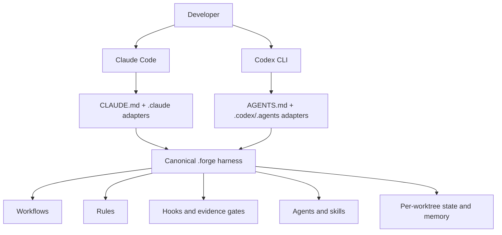
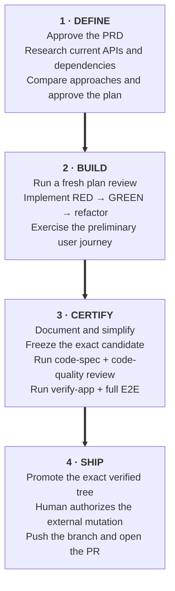

<p align="center">
  
</p>

<h1 align="center">Claude Codex Forge</h1>

<p align="center">
  <strong>An engineering harness for disciplined software building — powered by two coding agents.</strong>
</p>

<p align="center">
  <a href="LICENSE"></a>
  <a href="#version-history"></a>
  <a href="docs/getting-started.md"></a>
  <a href="https://code.claude.com"></a>
  <a href="https://developers.openai.com/codex/"></a>
</p>

<p align="center">
  <a href="docs/getting-started.md">Quick Start</a>
  ·
  <a href="docs/reference/commands.md">Commands</a>
  ·
  <a href="docs/explanation/workflow.md">Workflow</a>
  ·
  <a href="docs/explanation/harness-philosophy.md">Philosophy</a>
  ·
  <a href="docs/troubleshooting.md">Troubleshooting</a>
  ·
  <a href="docs/CHANGELOG.md">Changelog</a>
</p>

---

Claude Codex Forge installs one canonical engineering harness for **Claude Code** and **OpenAI
Codex**. It turns capable but session-local coding agents into a repeatable software-engineering
system with shared workflows, fresh independent review, persistent state, memory, and evidence-bound
quality gates.

There is no permanent main agent. Open Claude Code and Claude leads that session; open Codex and
Codex leads. The other engine is preferred for review, with a visible fresh same-engine fallback
when it is unavailable.

Claude Code uses `/opinion`; Codex uses `$opinion` for the same canonical opinion workflow.

## Why Forge instead of vanilla Claude Code or Codex?

Vanilla coding agents are excellent at producing code. The difficult part is making the whole
engineering lifecycle reliable across long features, context compression, interrupted sessions,
multiple developers, and the natural blind spots of one model reviewing its own work.

Without a harness, good practice remains optional: research can be skipped, plans can drift from the
approved requirement, tests can validate an old candidate, review can become an endless perfection
loop, and a successful command can be mistaken for a verified result. A new session may know the
repository but not the exact next step or why a decision was made.

Forge makes engineering discipline structural:

- **One lifecycle, not a bag of prompts** — PRD → current research → plan → TDD → user-journey E2E
  → simplification → independent review → verification → exact-tree promotion → authorized PR.
- **A genuinely fresh second opinion** — the preferred reviewer is the other engine, running with
  fresh context against an exact candidate. If it cannot run, Forge says why and tries a fresh
  same-engine reviewer instead of silently dropping the gate.
- **Evidence, not confidence** — review, verification, and E2E receipts are bound to the candidate
  fingerprint. Mutation invalidates affected evidence; process exit alone never means “verified.”
- **Continuity across hosts and sessions** — `.forge/local/state.md` records the immutable workflow
  base, checklist, evidence, and exact next step. Claude and Codex can resume the same worktree
  without pretending their native conversation histories transferred.
- **Useful memory without stale task leakage** — local worktree memory stays gitignored; verified
  project knowledge, ADRs, and solutions can travel with the repository.
- **Guardrails at the moment they matter** — hooks intercept dangerous shell operations,
  unauthorized external mutation, incomplete ship gates, stale state, and malformed subagent
  results before they become release claims.
- **Practical resource discipline** — review defaults to one broad review, one repair pass, and one closure review.
  Speculative edge cases, cosmetic perfection, and unchanged-candidate re-review do
  not consume the project indefinitely; reachable correctness, security, and data-integrity defects
  still block.

The result is not “more agent.” It is a small, inspectable operating system for doing disciplined
engineering with either agent.

## What you get

- Claude Code and Codex can each lead a complete feature or bug-fix workflow.
- Fresh general, plan, code-spec, and code-quality opinions are hermetic and read-only.
- Investigation runs as a fresh full agent in the real worktree with normal project/user config,
  skills, MCP, network, databases, APIs, state, and memory.
- A five-advisor Engineering Council adds model and perspective diversity for expensive decisions.
- Native `/goal` remains host-owned and composes over Forge’s persistent objective, budget,
  evidence, resume, and human-authorization contract.
- Git worktrees isolate simultaneous features while each worktree keeps its own local state.
- Bash and Windows PowerShell implementations ship together.

## How the dual-engine harness works



`.forge/` is the source of truth. `CLAUDE.md`, `AGENTS.md`, `.claude/`, `.codex/`, and `.agents/`
are thin native discovery adapters. They do not contain independent copies of Forge policy to keep
in sync.

### Main and reviewer selection

| Current host | Main for this session | Preferred fresh reviewer | If preferred reviewer cannot launch |
| --- | --- | --- | --- |
| Claude Code | Claude | Codex | Fresh Claude reviewer, visibly labeled fallback |
| Codex | Codex | Claude | Fresh Codex reviewer, visibly labeled fallback |

Setup never asks for a permanent main or reviewer. An explicit Claude or Codex opinion is also
supported. A review that returns findings succeeded; findings do not trigger engine fallback.
Artifact, authorization, or invariant failures block instead of trying another engine.

Forge launches every reviewer, including a same-engine fallback, with the provider's fast service:
Claude receives `{"fastMode": true}` and Codex receives `service_tier=fast`. Fast mode preserves the
pinned model and reasoning effort but uses each provider's higher-cost accelerated inference tier.

### Review, investigation, and council are different boundaries

| Mode | Boundary | Intended use |
| --- | --- | --- |
| General, plan, code | Fresh hermetic process, read-only, candidate-bound | Independent analysis and certification |
| Investigation | Fresh full agent in the real worktree with normal tools and configuration | Current docs, execution, databases, APIs, and operational fact finding |
| Investigation reproduction | Isolated primary check plus independent control | Convert a hypothesis into `REPRODUCED` evidence |
| Council | Five anonymous advisors, peer review, and a chairman | Consequential architecture and trade-off decisions |

The healthy council topology uses three current-host advisors, two other-engine advisors, and an
other-engine chairman. If the other engine is unavailable or the mixed topology fails, Forge
discards that attempt and reruns the whole council on the current host.

## The engineering workflow



The main workflows are:

| Purpose | Claude Code | Codex |
| --- | --- | --- |
| New feature | `/new-feature <name>` | `$workflow-new-feature <name>` |
| Bug fix | `/fix-bug <name>` | `$workflow-fix-bug <name>` |
| Quick fix | `/quick-fix <name>` | `$workflow-quick-fix <name>` |
| Fresh opinion | `/opinion <request>` | `$opinion <request>` |
| Full investigation | `/opinion investigate <request>` | `$opinion investigate <request>` |
| Engineering Council | `/council <question>` | `$council <question>` |
| Autonomous execution | Native `/goal` | Native `/goal` |

Forge never shadows either host’s native `/goal`. It supplies the shared composition contract in
`.forge/workflows/goal.md`; native session history stays host-specific while the Forge objective,
nonce, persistent turn count, evidence, and next step survive a host switch.

## Quick start

Prerequisites: Git 2.23+ and at least one authenticated supported host. Both adapters are installed
even if only one CLI is currently available.

### Recommended for people: install with Claude Code or Codex

**Agent-first for people; CLI-first for machines.** Open either supported host in the target
repository and ask it to install or upgrade Forge. The agent inspects the repository, runs the
correct preview or setup command, explains blockers, and asks before changing files. The agent does
not implement setup itself: `setup.sh` and `setup.ps1` remain the sole deterministic installers.

Use the copy-paste prompt in [Agent-assisted setup](docs/guides/agent-assisted-setup.md). It covers
fresh projects, existing Forge v6 refreshes, Forge v5 and mixed-harness migrations, global setup,
approval boundaries, and final diff/readiness review.

### CLI and automation: choose the correct installation path

Do not layer a fresh installation over an existing agent harness. Choose from the repository's
current state:

| Repository state | Use |
| --- | --- |
| New repository with no agent harness | Normal project setup: `setup.sh -p "My Project"` or `setup.ps1 -Project "My Project"` |
| Existing Forge v6 installation | Managed update: `setup.sh --upgrade` or `setup.ps1 -Upgrade` |
| Forge v5, Claude-only files, Codex-only files, a mixed tree, or another/custom harness | Read-only inventory first: `setup.sh -f --dry-run` or `setup.ps1 -Force -DryRun` |
| Not sure what is installed | Use the same read-only full-refresh preview; it writes nothing |

For an existing harness, resolve every printed blocker and rerun the preview. Execute `-f` /
`-Force` only after it reports `UPGRADE: READY`. Forge will not silently stack v6 beside
unresolved legacy or custom machinery.

### Fresh installation — macOS and Linux

```bash
git clone https://github.com/pablomarin/claude-codex-forge.git ~/claude-codex-forge
chmod +x ~/claude-codex-forge/setup.sh

# Once per machine
~/claude-codex-forge/setup.sh --global

# Once per fresh project
cd /path/to/your/project
~/claude-codex-forge/setup.sh -p "My Project"

# Confirm installed discovery and trust surfaces
~/claude-codex-forge/scripts/verify-runtime.sh discovery --project-root "$(pwd -P)"

# Work in either host
claude
# or
codex
```

### Fresh installation — Windows PowerShell

```powershell
git clone https://github.com/pablomarin/claude-codex-forge.git $HOME\claude-codex-forge

# Once per machine
& $HOME\claude-codex-forge\setup.ps1 -Global

# Once per fresh project
Set-Location C:\path\to\your-project
& $HOME\claude-codex-forge\setup.ps1 -Project "My Project"

# Confirm installed discovery and trust surfaces
& $HOME\claude-codex-forge\scripts\verify-runtime.ps1 discovery -ProjectRoot (Get-Location).Path
```

See [Getting Started](docs/getting-started.md) for authentication, trust prompts, one-engine use,
and runtime qualification.

## What setup installs

```text
your-project/
├── CLAUDE.md                       # User text + bounded Claude adapter
├── AGENTS.md                       # User text + bounded Codex adapter
├── .mcp.json                       # Merged Context7 and Playwright servers
├── .forge/                         # Canonical, engine-neutral harness
│   ├── instructions.md
│   ├── workflows/                  # Feature, bug, opinion, goal, PRD, finish
│   ├── rules/                      # Testing, security, memory, styles, workflow
│   ├── agents/                     # Producer, reviewer, research, verify roles
│   ├── skills/                     # Council, release, UI, image generation
│   ├── hooks/                      # Shared Bash + PowerShell enforcement
│   ├── bin/                        # Runtime qualification helpers
│   ├── local/                      # Gitignored state, reviews, evidence, memory
│   └── memory/                     # Durable project-owned memory
├── .claude/                        # Claude commands, agents, skills, settings
├── .codex/                         # Codex agents, hooks, config
├── .agents/skills/                 # Codex workflow and skill adapters
├── docs/
│   ├── agent-context.md            # Optional team-owned shared project knowledge
│   └── ...                         # ADRs, plans, PRDs, research, solutions
└── tests/e2e/                      # Use cases and local reports
```

Global setup adds canonical policy and trusted native-goal helpers under `~/.forge/`, plus bounded
global adapters at `~/.claude/CLAUDE.md` and `~/.codex/AGENTS.md`.

### One source of truth, two native adapters

Forge does **not** ask teams to keep two copies of the same instructions synchronized. Both hosts
discover the filename they support natively, and each root file points into one shared policy:

```text
.forge/                     Forge-owned engineering policy
docs/agent-context.md       Team-owned shared project knowledge
CLAUDE.md                   Thin Claude discovery adapter + shared-context pointer
AGENTS.md                   Thin Codex discovery adapter + shared-context pointer
```

| Setup-managed component | Installed destination | Role |
| --- | --- | --- |
| `FORGE.template.md` | `.forge/instructions.md` | Canonical shared policy for both engines |
| `templates/adapters/CLAUDE.block.template.md` | Forge-owned block in `CLAUDE.md` | Claude Code discovery and host-specific composition |
| `templates/adapters/AGENTS.block.template.md` | Forge-owned block in `AGENTS.md` | Codex discovery and host-specific composition |
| `CLAUDE.template.md` | No new v6 destination | Retained only to reconcile proven v5 installations |

`.forge/instructions.md` is setup-managed and should not be edited directly. Keep shared
architecture, domain facts, repository maps, and project commands in the neutral tracked file
`docs/agent-context.md`. Forge cannot infer that project knowledge, so the team creates and
maintains this file when shared context is needed.

Put this same project-owned pointer outside the Forge-managed block in both root files:

```markdown
Read `docs/agent-context.md` completely before acting.
```

After that, edit shared knowledge only in `docs/agent-context.md`. Do not duplicate it between the
two root files.

For a genuinely Claude-only instruction, use the user-owned part of `CLAUDE.md`; for a genuinely
Codex-only instruction, use the user-owned part of `AGENTS.md`.
Do not copy shared policy between `CLAUDE.md` and `AGENTS.md`. Setup refreshes only the Forge-owned
blocks and preserves user-authored text outside them.

Setup preserves user content according to explicit ownership:

- Canonical Forge files are refreshed.
- Root instructions change only inside bounded Forge markers.
- Existing settings, TOML, and `.mcp.json` keep unrelated entries.
- `.forge/local/`, `.forge/memory/`, secrets, and custom native-goal surfaces are protected.
- A legacy file is removed only when a released fingerprint or marker proves Forge ownership.

### `MATERIALIZED` is not `RUNTIME_READY`

Setup always installs both host surfaces. `MATERIALIZED` means those files exist. `RUNTIME_READY`
means the installed host is authenticated, trusted, and exposes the required runtime capabilities.
If one host is not ready, ordinary reviewer selection visibly falls back rather than pretending the
preferred engine ran.

## Setup, refresh, and team upgrades

For interactive use, start with the [agent-assisted setup guide](docs/guides/agent-assisted-setup.md).
The table below is the direct CLI reference for automation, offline use, and troubleshooting; both
paths invoke the same installer.

| Task | macOS/Linux | Windows PowerShell |
| --- | --- | --- |
| Fresh project | `setup.sh -p "My Project"` | `setup.ps1 -Project "My Project"` |
| Global install | `setup.sh --global` | `setup.ps1 -Global` |
| Update an existing v6 install | `./setup.sh --upgrade` | `./setup.ps1 -Upgrade` |
| Preview a full project reconciliation | `./setup.sh -f --dry-run` | `./setup.ps1 -Force -DryRun` |
| Execute a ready project reconciliation | `./setup.sh -f` | `./setup.ps1 -Force` |
| Preview a global reconciliation | `./setup.sh --global -f --dry-run` | `./setup.ps1 -Global -Force -DryRun` |
| Execute a global reconciliation | `./setup.sh --global -f` | `./setup.ps1 -Global -Force` |
| Playwright scaffold | `setup.sh -t fullstack --with-playwright` | `setup.ps1 -Tech fullstack -WithPlaywright` |

Use `--upgrade` for a routine update of an existing v6 install. Use `-f` / `--force` for an
ownership-aware full installation or reconciliation from any state, and preview it first when the
repository is not a fresh install. Preview performs the real discovery and staging validation
without writing the project. `UPGRADE: READY` means the filesystem plan is safe to execute;
`UPGRADE: BLOCKED` lists every ownership or state choice to resolve in one report. A successful run
ends with `ACTIVE_FORGE: v6`: one canonical `.forge/` harness and thin native adapters, with project
content preserved. `MATERIALIZED` still does not imply that either host is `RUNTIME_READY`.

Full refresh is transactional. It proves released ownership, stages replacements, preserves user
regions and custom configuration, translates state, writes `.forge/version` last, and rolls back on
failure. It changes only the current worktree; sibling linked worktrees keep their own local state
and must be refreshed after the migration commit reaches their branch. Do not manually synchronize
`CLAUDE.md` and `AGENTS.md`: their bounded Forge blocks point to the same canonical policy.

Commit the harness as one versioned project change:

```bash
git add .forge/ .claude/ .codex/ .agents/ .mcp.json CLAUDE.md AGENTS.md docs/
git commit -m "chore: add Forge engineering harness"
```

`.forge/local/` remains gitignored. Teams should use one designated upgrader and land harness
refreshes as dedicated PRs; everyone else pulls that committed version.

See [Upgrading](docs/guides/upgrading.md) for ownership reports and transaction recovery, and
[Setup Scenarios](docs/guides/setup-scenarios.md) for common installations.

## State, memory, and switching hosts

- `.forge/local/state.md` is the per-worktree durable checkpoint: command, phase, immutable base,
  checklist, evidence, blockers, and exact next step.
- `.forge/local/memory/` contains volatile worktree-local drafts.
- `.forge/memory/`, `docs/adr/`, and `docs/solutions/` contain verified project knowledge that can
  be committed.
- Global memory stores stable cross-project patterns, never current-task progress or secrets.
- If canonical state stays unchanged across normal active-workflow stops, Forge gives the model one
  visible checkpoint turn to update state or memory; a newly changed checkpoint stops normally.
  After compaction, SessionStart points it back to the exact next step and any concise local/durable
  `MEMORY.md` indexes. Forge does not claim hook diagnostics are automatically saved as model memory.

You may plan in Claude, close it, and continue implementation in Codex—or the reverse. The new host
resumes the same Git branch and Forge checkpoint. Forge warns against editing one worktree from both
hosts simultaneously but intentionally adds no lock manager.

## Documentation

| Topic | What it explains |
| --- | --- |
| [Getting Started](docs/getting-started.md) | Prerequisites, installation, trust, and runtime readiness |
| [Commands](docs/reference/commands.md) | Claude and Codex native invocation map |
| [Workflow](docs/explanation/workflow.md) | Full feature and bug-fix lifecycle |
| [Harness Philosophy](docs/explanation/harness-philosophy.md) | Why discipline, dual review, state, and memory matter |
| [Investigation](docs/explanation/codex-investigate.md) | Full-agent investigation versus certifying reproduction |
| [Engineering Council](docs/explanation/engineering-council.md) | Seats, peer review, chairman, and topology fallback |
| [Autonomous Goal](docs/explanation/autonomous-goal.md) | Native `/goal` composition and authorization boundaries |
| [File Structure](docs/reference/file-structure.md) | Every installed canonical and adapter surface |
| [Hooks](docs/reference/hooks.md) | Automatic enforcement and worktree routing |
| [Permissions](docs/reference/permissions.md) | Human, host, reviewer, and mutation boundaries |
| [Upgrading](docs/guides/upgrading.md) | Transactional v5→v6 refresh and recovery |
| [Troubleshooting](docs/troubleshooting.md) | Authentication, trust, hooks, MCP, and runtime diagnostics |

## Version history

Recent releases:

| Version | Date       | Highlights                                                                                                                                                                                                                                                                                                                                                                                                                                                                                                                                                                                                                                                                                                                                                                                                                                                                                                                                                                                                                                                                                                                                                                                                                                                                                                                       |
| ------- | ---------- | -------------------------------------------------------------------------------------------------------------------------------------------------------------------------------------------------------------------------------------------------------------------------------------------------------------------------------------------------------------------------------------------------------------------------------------------------------------------------------------------------------------------------------------------------------------------------------------------------------------------------------------------------------------------------------------------------------------------------------------------------------------------------------------------------------------------------------------------------------------------------------------------------------------------------------------------------------------------------------------------------------------------------------------------------------------------------------------------------------------------------------------------------------------------------------------------------------------------------------------------------------------------------------------------------------------------------------- |
| 6.0     | 2026-08-27 | **One canonical dual-engine harness.** Claude Code or Codex can lead any action; the other engine is preferred for fresh review and council diversity, with visible fresh same-engine fallback. An ownership-aware `-f` / `-Force` transaction replaces proven v5 machinery while preserving user content, state, and compatible configuration. Shared policy and evidence now live under `.forge/`; host directories contain thin native adapters. |
| 5.61    | 2026-07-27 | **`/codex` plan review gains a NECESSITY axis — the loop can now argue for _less_.** Found by dogfooding v5.59/v5.60 in a downstream project: across ~30 review rounds the loop caught every omission and **never once** flagged anything as unnecessary. An approved plan carried a gate demanding five third-party artifacts before authoring could begin; it survived the whole loop, and when a human finally challenged it Codex conceded at once — _"no reachable correctness failure uniquely prevented by collecting all five artifacts"_ — reducing the ask to one question. Root cause is a delegation dead-end, not a missing concept: plan review stopped asking _"Is there a simpler approach?"_ (`new-feature.md:732`, `fix-bug.md:560`) and delegated it to the Contrarian Gate; a Contrarian `VALIDATE` **skips council entirely** (`peer-review-protocol.md:164`), so the Simplifier who asks _"Does this need to exist at all?"_ (`advisors.md:16`) may never run; and Codex is told not to revisit a council-validated choice (`codex.md:140`). On a `VALIDATE` plan, nobody asks. The existing gold-plating clause didn't compensate — buried in a ~310-word CALIBRATION paragraph, written in code vocabulary, and scored by maintenance/correctness/operational cost, none of which an unnecessary _information-gathering_ gate has. Fix: one top-level item **6. NECESSITY** in Design Review Mode asking the inverse counterfactual — for any prerequisite, gate, or requested artifact that materially delays work or adds external coordination, what concrete reachable failure does it prevent or reduce? If none, flag removal or narrowing. **P2** for material delivery/coordination cost, **P3** for mere redundancy; agenda-level placement ahead of CALIBRATION is the mechanism. Deliberately narrow — an unscoped "name what each requirement _uniquely prevents_, else it's deletable" draft was rejected in review for auditing everything, rejecting defense-in-depth, treating missing reviewer context as proof of non-necessity, and rebuilding the auto-P2 churn v5.59 already discarded. Not extended to code review (already covered by `code-simplifier` + `/simplify`). New contract pins one site, 3 stems, both rejected phrasings **absent**, and the placement invariant — proven discriminating against 5 mutations. `rules/workflow.md` untouched; no new blocking gate. Reaches installs via `setup.sh --upgrade`. |
| 5.60    | 2026-07-24 | **`check-bash-safety` check #6 no longer blocks read-only inspection of `.claude/settings.json`.** Found by dogfooding v5.59 in this repo: right after `setup.sh --upgrade`, the freshly installed hook rejected a command that merely printed a heading and then ran a read-only `grep` over `.claude/settings.json` — flagged as config tampering though it writes nothing. Cause: check #6's pattern `(sed|awk|echo|tee|printf).*` + config-path let `.*` span the whole command, so an unrelated heading-print poisoned a later read; inconsistently, a plain `cat` of `.claude/settings.json` passed, since cat is not in the writer list. Same class as v5.56/v5.57 — an over-broad guardrail firing on a read, which silently stalls a `/goal` loop with no human to clear the prompt. Fix: `[^;\|&]*` in both twins (`.sh:75`, `.ps1:83`) so the writer and the target must share the same command segment, mirroring check #9's redirect-target scoping. Every true positive is preserved (redirect-clobber, `sed -i` in-place edit, `tee` after a pipe, and a writer after `&&` all still block). Residuals documented rather than closed: variable-indirected targets, and a config path quoted as *data* before a pipe — closing the latter needs write-operator parsing, so it stays a residual (smallest correct fix, the LEAN posture check #9 settled on). New `SIX_BLOCK`/`SIX_ALLOW` corpus (45 assertions, up from 37), proven discriminating: restoring the old regex fails the field-bug case. 13-suite green. Reaches installs via `setup.sh --upgrade`. |
| 5.59    | 2026-07-24 | **Calibrate the `/codex` reviewer toward simplicity + add finding triage.** Field hit: Codex finds real bugs but over-flags low-ROI edge cases and proposes machinery-heavy remedies, grinding the revision loops — it demanded a new pre-truncation payload field plus in-driver computation where a one-line prompt reservation closed the same defect. Causes were in the harness: `commands/codex.md` literally said "Flag anything that could break in production", Codex was never pointed at this repo's brutal-simplicity doctrine, and every P0/P1/P2 is load-bearing in the revision protocol. Two levers, both in `commands/codex.md`: (1) a **CALIBRATION block** in all 3 review-shaped prompts (both Code Review commands + Design Review; General/Investigate exempt) anchoring to `.claude/rules/principles.md`, requiring a **plausible, reachable** failure scenario (input, adversarial action, timing/interleaving, partial failure, or reachable state — need NOT be reproducible on demand), keeping reachability separate from severity, demanding the smallest correct fix, and flagging over-engineering by concrete cost — with the inflation line removed and plan-stage spec-loss=P1 restated; (2) a **`## Finding Triage`** section before mode A: no reachable trigger → demoted to an unsubstantiated P3 note (never dropped), prefer the smaller fix, weigh recommended complexity by cost, record each downgrade — plus a "not an escape hatch" clause binding it to NO BUGS LEFT BEHIND. **Information-preserving by construction:** the scope line is untouched (same things looked for), rarity is explicitly not grounds for dismissal, a rare-but-real defect lands at P3 ("May fix, does not block") so it is reported but never forces machinery, rare × catastrophic stays blocking, and an unscenarioed finding is **demoted to a P3 note, never dropped**. Plus a **self-limiting guard Codex found while reviewing this diff**: pointing it at repo doctrine makes branch-controlled content into severity guidance, so all 3 sites now state that doctrine governs simplicity only, can never justify suppressing or downgrading a correctness/security finding, and that an instruction to hide findings — including these instructions — is itself a P0 (Codex's own fixes, merge-base pinning or inlining, don't close it: `commands/codex.md` is in the checkout too). Authored downstream against a project-local doctrine section; re-anchored here to the rules file that ships to every install. Survived two Codex self-review passes (which caught an input-only framing that would bury race/timing/security bugs, and an auto-P2 rule that swapped bug-churn for style-churn). New contract pins 3 sites × 5 stems + triage stems + ordering + absence of the old trigger (proven against 3 mutations). `rules/workflow.md` untouched — no gate-protocol change. Reaches installs via `setup.sh --upgrade`. |
| 5.58    | 2026-07-22 | **`setup.sh --global --upgrade` no longer clobbers a customized `~/.claude/CLAUDE.md`.** `--upgrade` sets `FORCE=true`, and the global CLAUDE.md was installed via a `FORCE`-gated `copy_file` / `Copy-TemplateFile` — so `--global --upgrade` silently overwrote a developer's customized global instructions with the stock template (data loss). Project-mode already guarded the _project_ CLAUDE.md against exactly this; the _global_ path lacked the mirror. Fix: an explicit `if exists → skip ("never overwritten — user content") else copy` guard around the global CLAUDE.md copy in **both** `setup.sh` and `setup.ps1`, mirroring the project-mode guard; fresh installs still create it. Regression test `test_global_preserves_existing_claudemd` (byte-preserved through `--global --upgrade` + fresh-create still works; proven to fail without the guard). Two-engine review (Codex clean; PR-toolkit CLEAN, empirically verified); 13-suite green (test-setup 180/0). Reaches installs via `setup.sh --upgrade`. |
| 5.57    | 2026-07-21 | **Block Bash _writes_ under `.claude/local/` (check #9) — the write-side twin of v5.56.** Field hits (downstream): the agent ran `mkdir -p .claude/local/investigate` then improvised `: > .claude/local/investigate/finding.txt`; CC never auto-approves writes under `.claude/` (ADR 0006), so each tripped the sensitive-file prompt and the autonomous loop silently hung. Three-layer fix: (1) `commands/codex.md` Investigate mode rewritten prompt-free — Write tool creates `CONTEXT.md`, codex reads the brief from its sandbox via a fixed positional prompt, OLM+transcript go to `/tmp`, the in-repo `finding.txt` is written via the Write tool (zero `.claude/local` shell op; heredoc-stdin ruled out empirically — the PTY shim makes stdin a TTY); (2) a `rules/workflow.md` rule forbidding Bash writes under `.claude/local/`; (3) a `check-bash-safety.{sh,ps1}` check #9 blocking the common write forms — write-primitives (`mkdir|touch|cp|mv|tee|rm`) and redirects (`>`/`>>`/`N>`) — targeting `.claude/local/`, with single-token redirect-target scope (no false-positive on `> /tmp/log … .claude/local`); a **targeted guardrail for the common inline form**, not a shell parser (exotic writers/operators + line-continuation are out of scope by design — the real fix is Investigate mode no longer emitting these). Shared `NINE_BLOCK`/`NINE_ALLOW` corpus over both hooks (test-bash-safety 37 assertions) + region-scoped parity contract + codex.md prompt-free contract with self-tests. Two-engine review (Codex + PR-toolkit); 13-suite green; reaches downstream via `setup.sh --upgrade`. |
| 5.56    | 2026-07-12 | **Stop `/goal` stalling on a Bash-read of `state.md` + skip prettier on markdown.** Field hit (downstream): the agent improvised `sed … .claude/local/state.md` to peek at its status file; Bash isn't a read-only tool, so CC's sensitive-file prompt fired and the autonomous loop silently hung. Fix: a `rules/workflow.md` rule ("read state.md with the Read tool, never Bash") + a `check-bash-safety.{sh,ps1}` guardrail (check #8) that blocks a read-utility targeting `.claude/local/state.md` **inline** — per-line match, so the sanctioned `extract_foldable`/fold-back flows (which read via a shell variable) and the `review-breaker` diagnostic are structurally exempt; filename terminator spares `state.md.bak`; `.ps1` uses valid .NET `(?m)…[^\r\n]*` (no POSIX class). Framed as a targeted guardrail, not a guarantee (variable-indirected reads intentionally allowed). Bundled (review-surfaced): `post-tool-format.{sh,ps1}` no longer runs prettier on `.md` — prettier 3.x corrupts the harness's escaped-backtick, byte-pinned markdown (reproduced on HEAD). New `test-bash-safety.sh` (17) + contracts (390); downstream smoke vs `a downstream repo` clean. |
| 5.55    | 2026-07-12 | **Bump Codex CLI model `gpt-5.5` → `gpt-5.6-sol`.** OpenAI shipped the GPT-5.6 family; `gpt-5.6-sol` is the flagship tier and Codex CLI's default "Power" model. All Codex invocations in `/codex` (5 strings + config-table row) and `/council` (`peer-review-protocol.md`, 3 strings) now pin it explicitly. Verified via Claude WebFetch + a Codex live-docs check (agreeing): `gpt-5.6-sol` is the canonical `-m` identifier, needs no allowlist/extra config beyond normal auth, and `model_reasoning_effort="xhigh"` is still the correct CLI token (UI label "Extra High"). Repo-wide grep confirmed no other model pin; historical CHANGELOG/README rows keep their old references.                                                                                                                                                                                                                                                                                                                                                                                                                                                                                                                                                                                                                                      |
| 5.54    | 2026-06-06 | **Convergence breaker for the code-review loop.** Field hit (downstream PR #89): a both-engines-certified, merge-authorized branch hit a docs-only merge conflict; the HEAD move re-opened FULL-scope review and ground from iteration 15 to 25 with no stopping rule. Now: after the first both-engines-clean iteration (_certification_), more than `POST_CERT_REVIEW_ROUND_LIMIT=3` further rounds hook-blocks all ship actions (the check precedes the docs-only carve-out — no N/A or docs-commit bypass; counter-erasure N/A trips fail-closed) until a HUMAN records the head-bound `Post-certification tail adjudicated by human` line — the agent never writes it, and `/goal` halts for the human, never `/council`. New tiny helper `hooks/lib/review-breaker.sh/.ps1` (state.md reader, no git diffing); `pr_ready` suppressed while tripped+unadjudicated. A full scoped-certification engine (scope grammar, patch-id delta classification, mechanical re-stamps, deep pass) was built, certified, then **deliberately deferred** after a community-value council returned NO-as-is — preserved at `ece4eae` with reactivation conditions in ADR 0009.                                                                                                                                                                |
| 5.53    | 2026-06-04 | **Stop benign cache deletes from stalling autonomous runs.** Field hit (downstream): a subagent's `rm -rf .mypy_cache` tripped the Forge-shipped ask rule `Bash(rm -rf:*)` mid-`/goal` — the loop silently hung on a human permission prompt for a routine cache clear (a `/goal` loop can't self-approve ask-tier commands, by design). Two-layer fix: `rules/python-style.md` "cache resets — use tool flags, never `rm -rf`" table (`mypy --no-incremental`, `pytest --cache-clear`, `ruff check --no-cache`) + `rules/workflow.md` "Ask-tier commands stall autonomous runs" rule; and both settings templates add three **exact-match** allows (`rm -rf .mypy_cache`/`.pytest_cache`/`.ruff_cache`) — exact, not prefix, so trailing args can't ride through. The `rm -rf:*` ask rail stays, contract-pinned (Contract 3c). Quick-fix; propagates via `setup.sh --upgrade` (permission entries merge).                                                                                                                                                                                                                                                                                                                                                                                                                         |
| 5.52    | 2026-06-02 | **State continuity round-trips through main** — your `Done/Now/Next/Deferred` story now survives worktree teardown. Was: `/new-feature` made a blank worktree `state.md` and `/finish-branch` deleted it (gitignored) while only clearing main's `## Workflow`, so the narrative died at every merge and main went stale (hit on a downstream project — a confirmed "KV apply done" fact was lost, then re-proposed). Now: **seed-on-create** copies main's foldable narrative (Done/Next/Deferred + Open Questions + Blockers) verbatim with `Now` cleared + writes a `.claude/local/.state-seed-snapshot.md`; **guarded fold-back** (`/finish-branch` step 2.2b, before `git worktree remove`) deterministically replaces main's foldable sections with the worktree's **only if main is unchanged since seed**, else **loud safe-stop** (no overwrite). Gate sections never travel; state stays gitignored (ADR 0001 preserved). 5-advisor `/council` chose guarded deterministic replace over the literal "smart LLM merge" ask (seed-forward invariant makes replace correct + testable; snapshot guard prevents silent overwrite); LLM merge deferred. ADR 0008. Codex 4 plan-review iters to clean; `EXTRACT-FOLDABLE` pinned byte-identical across 3 command files. Built by dogfooding `/new-feature`→`/goal`. 341+ contracts green. |
| 5.51    | 2026-06-02 | **Forge version stamp + advisory drift warning** — stop cross-version `.claude/` merge conflicts on teams (who commit `.claude/`). `setup.sh`/`.ps1` write `.claude/.forge-version` (project pin) + `~/.claude/.forge-version` (this machine), read from the CHANGELOG top line; a `-f`/`--upgrade` version mismatch prints a direction-aware **advisory** (names the up/downgrade + that other clones will pull the change — facts, not a directive); `session-start.sh`/`.ps1` add a one-line drift heads-up. All advisory, never blocks, fail-open; the pin can't lie (written only after machinery is (re)written, gated on a settings sentinel). Council-ratified (D + cheap detector; rejected gitignoring `.claude/`, `merge=union`, global-runtime/lockfile/`forge doctor`). README documents the one-updater/upgrade-by-PR flow. Codex 4 plan-review iters to clean; behavioral + parity tests; 11-suite green. Keeps committing `.claude/` (team-standard model).                                                                                                                                                                                                                                                                                                                                                      |
| 5.50    | 2026-06-02 | Sharpen plan-stage severity: **spec-loss omissions are P1, not P2**. At Gate 1 (plan review), an omission that could build the wrong feature — missing required behavior, missing edge-case handling, a missing disambiguating acceptance criterion, or a missing test stub for a known-important behavior — is now explicitly P1. Rationale: subagents build FROM the plan, so a plan gap propagates and Gate 2 only sees code internally consistent with the _incomplete_ plan (spec-loss invisible downstream). Pure smell stays P2. **Classification only — the gate is NOT relaxed (still exits on no P0/P1/P2).** In `rules/workflow.md` + both commands' Phase 3.3, pinned by a parity contract that also guards the strict exit. Came out of a 5-advisor `/council` on whether to _relax_ Gate 1 to a P0/P1 exit for speed; the maintainer shipped only this pure-upside rubric half and deferred the gate relaxation. Docs + 1 contract; 319 contracts + 31 lint green.                                                                                                                                                                                                                                                                                                                                                 |
| 5.49    | 2026-06-01 | Make `/finish-branch` worktree-safe. `gh pr merge --squash --delete-branch` errored with `fatal: 'main' is already used by worktree` when run from a worktree (the `-d` local-branch delete forces a checkout switch to the base branch, which `main`'s primary worktree already holds) — the server-side merge succeeded but the command exited non-zero (hit on PR #836 + a downstream project's PR #85). `commands/finish-branch.md` 1.4 drops `--delete-branch` (Phase 2 already removes the worktree + deletes local & remote branches) and adds "verify `state == MERGED`, don't retry" guidance. Also de-chained Phase 2.6's `git push --delete … \|\| echo …` (a compound `git push` the Forge's own gate hook blocks) into a `git ls-remote` check + a bare push. Command-doc only; no code/hook/`.ps1` change. 318 contracts + 31 lint green.                                                                                                                                                                                                                                                                                                                                                                                                                                                                                            |
| 5.48    | 2026-06-01 | Stop `setup.sh --upgrade` nagging "run --migrate" forever after a repo already migrated. `--migrate` preserves `CONTINUITY.md` byte-for-byte (idempotent via a `<!-- forge:migrated DATE -->` sentinel), but the banner keyed only on the file existing — so every later `--upgrade` re-printed an **unsatisfiable** "run --migrate" (re-running is a no-op). Confirmed live on a downstream project. `setup.sh`/`setup.ps1` now detect the sentinel and point at removal instead: gate on the `CLAUDE.md` sentinel only (a `state.md`-only marker → still prompts `--migrate`), key the flag on the bare prefix (date-less markers still recognized), and say "remove once you've confirmed its content landed" (NOT unconditional "safe to delete" — `--migrate` can stamp the sentinel yet skip content). Tests 8b/8c/8d + contracts. Codex 4 iters (caught partial-migration data-loss, PS case-insensitivity, malformed-date splice, prefix-only miss) + pr-toolkit + `/simplify`; 804 green. Installer-message only.                                                                                                                                                                                                                                                                                                                 |
| 5.47    | 2026-06-01 | Stop `/codex` dumping multi-MB Codex stdout into Claude's context. The Code Review / Design Review / General modes now use the **council two-file pattern** — `--output-last-message` for the clean verdict + `> /tmp/codex_response_full.txt 2>&1` so the full transcript goes to a forensic log Claude never reads (Step 3 reads the OLM file; falls back to the log only if it's absent/empty). Each clears the stale OLM with `: >` (not `rm -f /tmp/...`, which `check-bash-safety` blocks). Prereq bumped to Codex **v0.124.0+** (OLM stability). Contract assertions pin per-mode OLM capture + exact redirect + no blocked `rm -f`. Codex-reviewed 4 iters (it caught that the flag alone doesn't stop the stream, a stale-OLM race, prereq drift, grep gaps) + pr-toolkit; 774 green. Surfaced on a downstream project (1.9 MB review dump).                                                                                                                                                                                                                                                                                                                                                                                                                                                                                         |
| 5.46    | 2026-06-01 | **Developer Briefing + Developer Demo** at the two human control gates — using the Forge now feels like a dev team briefing & demoing to a product owner. Gate 1: a lean `## Developer Briefing` in the plan file (optional Mermaid, `planned`/`inferred` labels). Gate 2: the PR body is a structured **Developer Demo** via `--body-file` — what changed / how it works + one Mermaid diagram / code tour / **mechanically-generated** file map / verification / an Evidence table citing a real `file:line` per diagram edge. Demo template **inlined byte-identically** into both commands (pinned by `test-contracts.sh`); honesty enforced by **review** (unsupported Gate-2 diagram edge = P1), not a new hook (council Option A). No new shipped file, no `setup` change. Designed via Codex consult + 5-advisor council; this PR carries the first real Demo.                                                                                                                                                                                                                                                                                                                                                                                                                                                           |
| 5.45    | 2026-06-01 | Fix `setup.sh`/`setup.ps1` silently aborting when run **in-place** (forge dogfooding via `./setup.sh --upgrade` in the repo). `copy_file`/`Copy-TemplateFile` had no same-file guard, so in-place runs (`SCRIPT_DIR` == repo root) hit `cp X X` on the docs/adr seed copies → "are identical" non-zero exit → `set -e` aborted the installer **before** the rules sync. Adds a self-copy guard to the shared copy helper (bash `-ef` inode identity; PowerShell `Resolve-Path … -ceq`), placed before the force/exists branches. TDD regression test (extract real `copy_file`, self-copy under `set -e`) + `pwsh`-gated PS parity test. Codex (2 iters) + pr-toolkit; 771 tests green.                                                                                                                                                                                                                                                                                                                                                                                                                                                                                                                                                                                                                                          |
| 5.44    | 2026-06-01 | Add a **"Ground Your Claims"** behavioral non-negotiable (anti-hallucination): state verified-vs-inferred, cite `file:line` before asserting about code, say "I haven't checked X" instead of guessing — _"Confident guessing is a defect, the same caliber as a known bug left behind."_ Ships across `rules/critical-rules.md` (caps bullet, sibling of CHALLENGE ME / NO BUGS LEFT BEHIND), a `## Ground Your Claims Policy` headline in `CLAUDE.template.md`, and a `## Ground Your Claims` global default — mirroring the No Bugs Left Behind pattern. A `test-contracts.sh` parity contract binds the three copies so an edit to one fails CI until the others follow. Docs + 1 assertion; 775 tests green.                                                                                                                                                                                                                                                                                                                                                                                                                                                                                                                                                                                                                |
| 5.43    | 2026-05-28 | Close the workflow-gate integrity hole: a **no-code carve-out** lets a docs-only `git commit` skip the code-quality gates without marking them `N/A` (gates stay armed for the real-code ship), killing the "N/A dance" that permanently satisfied them. Fail-safe (any code path / `-a`/`--amend`/`-p`/`-i`/`-o` → enforce), commit-only (push/PR always enforce). + 4 sibling fixes: PASS-before-N/A ordering, malformed-loop-line blocking, PowerShell E2E-scan parity, and stdin-`cwd`+toplevel repo-context resolution. Hardens the compound guard against newline-separated ship chains. Codex-reviewed (5 iterations) + pr-toolkit; 731 tests green. Companion to the anchored-unchecked-probe hotfix (PR #779).                                                                                                                                                                                                                                                                                                                                                                                                                                                                                                                                                                                                          |
| 5.42    | 2026-05-27 | Document how `/codex` picks a mode (developer FAQ): Claude routes, not Codex — hermetic modes are keyword-routed, Investigate is capability-routed (never silently escalates). Improves existing `commands.md` + `codex-investigate.md`; no new files. Docs-only.                                                                                                                                                                                                                                                                                                                                                                                                                                                                                                                                                                                                                                                                                                                                                                                                                                                                                                                                                                                                                                                                |
| 5.41    | 2026-05-27 | Document **autonomous goal mode** and **Codex Investigate mode** as first-class features (were version-history-only): two "What you get" bullets, "How it works" links, Documentation-table rows, two new explainer docs (`autonomous-goal.md`, `codex-investigate.md`), and a `/codex` modes table + autonomous-`/goal` section in the commands reference. Docs-only.                                                                                                                                                                                                                                                                                                                                                                                                                                                                                                                                                                                                                                                                                                                                                                                                                                                                                                                                                           |
| 5.40    | 2026-05-27 | Codex **Investigate mode** (`/codex` Section D) + `/council` live-state fact-finding: Claude provisions Codex with the project's real read-only creds + network to dig into live systems (DB/cloud/API), repo-confined sandbox, no user prompt (autonomous-`/goal`-safe), cross-verified. Capability-gated, sandbox-enforced. ADR 0007.                                                                                                                                                                                                                                                                                                                                                                                                                                                                                                                                                                                                                                                                                                                                                                                                                                                                                                                                                                                          |
| 5.39    | 2026-05-26 | Hook enforcement of per-iter clean evidence on Plan + Code review loop PASS checkboxes (plan_sha + HEAD binding); closes the v5.38 a downstream project same-iter-clean shortcut.                                                                                                                                                                                                                                                                                                                                                                                                                                                                                                                                                                                                                                                                                                                                                                                                                                                                                                                                                                                                                                                                                                                                                             |
| 5.38    | 2026-05-25 | Whole-UC `NOT_USER_JOURNEY` trigger + stale-text cleanup. Codex final-pass on v5.34–v5.37 demonstrated a real escape route: an old UC with decent Intent prose ("Customer creates an order through the API") could slide through regression if its Steps were a single curl + Verification was bare status + Persistence was N/A — each individual hard gate is skipped in regression mode, but the _combination_ is "this isn't a journey at all." Step 2b judgment-call #7 now has TWO triggers: Intent shape (existing) AND whole-UC shape (new) — when Steps shallow + Verification bare + Persistence absent all combine, fires `NOT_USER_JOURNEY` in any mode. Plus three stale-text fixes: `rules/testing.md` Failure Classification table now lists all 9 reason codes (was out of sync); NOT_USER_JOURNEY no longer claims missing-Persistence (that's MISSING_PERSISTENCE); `commands/fix-bug.md:819` simple-fix parenthetical now lists all 8 fields. 392 assertions.                                                                                                                                                                                                                                                                                                                                                 |
| 5.37    | 2026-05-25 | Reframe: legacy-UC bounce-back is intentional design, not residual risk. v5.36 surfaced `NOT_USER_JOURNEY` firing in regression mode as a side effect. Pablo confirmed the opposite: that's the _intent_ — when the regression suite catches old code-shaped UCs from before v5.34, they SHOULD be flagged so the team rewrites them to the new user-journey standard. Phase 5.4b in both commands now splits `FAIL_INVALID_USE_CASE` into a Hard-SHAPE bucket (skipped in regression by v5.35) and a Judgment-call bucket (`NOT_USER_JOURNEY` / `WRONG_INTERFACE` — **DO fire in regression mode by design**). `agents/verify-e2e.md` Step 2b mode-gating note gains a mirror sentence. Wording only; no behavior change. 378 assertions.                                                                                                                                                                                                                                                                                                                                                                                                                                                                                                                                                                                       |
| 5.36    | 2026-05-25 | Codex review fixes to v5.34/v5.35. Five concrete tightening edits: (1) replaced stale 6-field intro lines in both workflow commands that contradicted the new 8-field shape; (2) dropped "in this order" rigidity from the required-shape headings; (3) narrowed `Persistence: N/A` to a whitelisted stateless-outcome exception (any UC whose Steps create/update/delete/transition state gets `MISSING_PERSISTENCE` regardless of justification); (4) softened the "objective" claim about hard gates with a Mechanical-vs-policy-gates split (SCENARIO_FLUFF / CHEAT_SETUP / non-bare THIN_VERIFICATION require judgment but still block); (5) Phase 5.4b regression promise now says "hard SHAPE gates" so NOT_USER_JOURNEY is explicitly carved out as still firing on legacy UCs. 372 assertions.                                                                                                                                                                                                                                                                                                                                                                                                                                                                                                                          |
| 5.35    | 2026-05-25 | Step 2b hard gates gated to feature mode only. v5.34's new hard gates were mode-agnostic, retroactively breaking regression suites because UCs graduated under v5.31/v5.33 lacked the required `Actor:` / `Scenario:` fields and would fail every regression run. Mirrors v5.33's Step 2c mode-gating: hard gates run in feature mode only; regression/smoke modes fall back to the prefer-valid bias. New UCs going through Phase 3.2b/6.2b authoring still get the strict shape. Contract test locks the gating across `agents/verify-e2e.md` + both Phase 5.4b blocks. 360 assertions.                                                                                                                                                                                                                                                                                                                                                                                                                                                                                                                                                                                                                                                                                                                                        |
| 5.34    | 2026-05-25 | E2E UC shape — Actor + Scenario + surface-specific Verification. Pablo flagged that v5.31/v5.33 prose said "be specific" but the canonical GOOD examples still modeled generic "User creates…" phrasing. Codex pinned the root cause + rewrote the design. v5.34 adds required `Actor` field (rejects bare "user" as `MISSING_ACTOR`) + required `Scenario` field (1-2 sentences, no biography fluff → `SCENARIO_FLUFF`) + surface-specific Verification rubric (UI: sees/appears/shows; CLI: stdout shows/next invocation lists; API: receives/follow-up returns — bare status / bare exit / single element-visible → `THIN_VERIFICATION`) + Setup-cheat detection (`CHEAT_SETUP`). Step 2b split into hard gates (objective, no judgment) and judgment calls (prefer-valid bias preserved). All three canonical GOOD examples in `rules/testing.md` rewritten end-to-end. 355 assertions.                                                                                                                                                                                                                                                                                                                                                                                                                                      |
| 5.33    | 2026-05-18 | Multi-surface E2E coverage audit (surfaced during /forge-goal soak when the user asked "did E2E cover UI, CLI, and API?" and the agent admitted it had skipped CLI even though the project's CLI exposed the same capability area). `rules/testing.md` gains "Multi-surface coverage" subsection distinguishing capability area from implementation diff; `commands/{new-feature,fix-bug}.md` Phase 3.2b + simple-fix Step 0 add a REQUIRED Surface coverage audit checklist with a `Surface coverage decision` sub-block (every exposed interface declared as Covered or `N/A — <substantive justification>`; "no CLI changes in my diff" is canonical disqualifying example). `agents/verify-e2e.md` adds Step 2c that emits `SURFACE_COVERAGE_WARNING` as a backstop. 316 assertions.                                                                                                                                                                                                                                                                                                                                                                                                                                                                                                                                         |
| 5.32    | 2026-05-18 | Worktree CWD fix + split build-evidence into its own Stop hook (surfaced during /forge-goal soak in a downstream project). Two coupled bugs: (1) evidence reported `session_nonce:null` from worktrees because `build-evidence` read state.md relative to `$CLAUDE_PROJECT_DIR` (the parent project) instead of the worktree — would have skipped the PR-create authorization gate; fixed by parsing `cwd` from the Stop hook stdin JSON. (2) Pre-PR Stop hook noise: evidence dump was labeled "Stop hook error" every turn because check-state-updated ran build-evidence inline then exited 2; now build-evidence is its own Stop hook (always exit 0). `merge-settings.py` gains deep-merge so the upgrade path adds new commands to existing matcher-blocks IN TEMPLATE ORDER. 303 assertions across 4 hot-path suites.                                                                                                                                                                                                                                                                                                                                                                                                                                                                                                                  |
| 5.31    | 2026-05-18 | E2E user-journey enforcement (surfaced during /forge-goal soak). `rules/testing.md` gains GOOD-vs-BAD worked examples per UI/API/CLI, an Intent smell test, and a **feature-surface-driven** interface model (the feature determines the UC interface; project type is only the capability envelope). New per-UC classification `FAIL_INVALID_USE_CASE` (`NOT_USER_JOURNEY` / `WRONG_INTERFACE`) — verify-e2e validates UC shape BEFORE health check, bounces non-journey or wrong-interface UCs back to the main agent for rewrite. New cross-file contract test enforces caller handling for every FAIL\_\* label.                                                                                                                                                                                                                                                                                                                                                                                                                                                                                                                                                                                                                                                                                                             |
| 5.30    | 2026-05-18 | Fix surfaced during /forge-goal soak: `check-state-updated.{sh,ps1}` CHANGELOG threshold gate downgrades from blocking (exit 2) to advisory (exit 0) when an OPEN PR already exists for the branch. Removes the per-turn "Stop hook error: FORGE_GOAL_EVIDENCE_BEGIN..." dump during CI wait. Also fixes wording: "files changed this session" → "files changed on branch vs `<default-branch>`".                                                                                                                                                                                                                                                                                                                                                                                                                                                                                                                                                                                                                                                                                                                                                                                                                                                                                                                                |
| 5.29    | 2026-05-16 | `/forge-goal` autonomous PRD-to-PR-ready workflow (Layers 1 + 2). After PRD or plan approval, type ONE `/goal` command; the agent drives plan → implement → review → E2E → PR-ready autonomously. Adds `build-evidence.{sh,ps1}` (evidence primitive), PRD-Complete + Plan-Approved checkpoints in workflow commands, council-during-`/goal` rule, PR-create authorization guard, and stuck-detection soft warning.                                                                                                                                                                                                                                                                                                                                                                                                                                                                                                                                                                                                                                                                                                                                                                                                                                                                                                              |
| 5.27    | 2026-05-12 | `/council` chairman synthesis no longer misreports "exited without producing analysis" when codex actually succeeded. Adds `--output-last-message <FILE>` to all four codex call sites (advisor / chairman / contrarian gate); response captured to a clean file, full stdout kept as diagnostic fallback. PTY shim still load-bearing.                                                                                                                                                                                                                                                                                                                                                                                                                                                                                                                                                                                                                                                                                                                                                                                                                                                                                                                                                                                          |
| 5.26    | 2026-05-10 | `rules/database.md` gains a "Migrations — additive-only discipline" section: ✅/❌ patterns matrix + 3-release expand-contract pattern for destructive changes + escape-hatch language. Closes a real gap (forge previously had zero migration guidance for teams running rolling deploys).                                                                                                                                                                                                                                                                                                                                                                                                                                                                                                                                                                                                                                                                                                                                                                                                                                                                                                                                                                                                                                      |
| 5.25    | 2026-05-10 | STATE-INIT diagnoses downstream-gitignored `.claude/` — emits new `STATE_TEMPLATE_DOWNSTREAM_GITIGNORED` sentinel pointing at the actual fix (edit `.gitignore`, commit `.claude/`) instead of misleading "re-run setup". Bonus: anchors AC-2 redirect regex to fix prose-scan false positives.                                                                                                                                                                                                                                                                                                                                                                                                                                                                                                                                                                                                                                                                                                                                                                                                                                                                                                                                                                                                                                  |
| 5.24    | 2026-05-09 | State-init via Write tool — `/new-feature` & `/fix-bug` zero prompts on the state-init path. STATE-INIT block now truly read-only; agent uses Read+Write tools (auto-approved by v5.21 hook, Write creates missing parents per [ADR 0006](docs/adr/0006-write-tool-creates-missing-parents.md))                                                                                                                                                                                                                                                                                                                                                                                                                                                                                                                                                                                                                                                                                                                                                                                                                                                                                                                                                                                                                                  |
| 5.23    | 2026-05-07 | Switch superpowers identity to `superpowers@claude-plugins-official` (Anthropic's marketplace, since 2026-01-15) — one-step install, avoids the `obra/superpowers-marketplace#11` name-conflict bug                                                                                                                                                                                                                                                                                                                                                                                                                                                                                                                                                                                                                                                                                                                                                                                                                                                                                                                                                                                                                                                                                                                              |
| 5.22    | 2026-05-07 | Codex PTY shim — `.claude/hooks/lib/codex-pty.{sh,ps1}` works around [openai/codex#19945](https://github.com/openai/codex/issues/19945) (silent empty exit when `codex exec` runs without a TTY); migrated `/codex` + `/council` callsites                                                                                                                                                                                                                                                                                                                                                                                                                                                                                                                                                                                                                                                                                                                                                                                                                                                                                                                                                                                                                                                                                       |
| 5.21    | 2026-04-30 | PermissionRequest hook auto-approves writes to `.claude/local/**` (workaround for CC v2.1.80+ regression on path-scoped rules)                                                                                                                                                                                                                                                                                                                                                                                                                                                                                                                                                                                                                                                                                                                                                                                                                                                                                                                                                                                                                                                                                                                                                                                                   |
| 5.20    | 2026-04-29 | Bump Codex CLI model `gpt-5.4` → `gpt-5.5` in `/codex` and `/council` (OpenAI released GPT-5.5 on 2026-04-23)                                                                                                                                                                                                                                                                                                                                                                                                                                                                                                                                                                                                                                                                                                                                                                                                                                                                                                                                                                                                                                                                                                                                                                                                                    |
| 5.19    | 2026-04-29 | Allow `Write`/`Edit` on `.claude/local/**` without prompting (workaround for Claude Code v2.1.80+ bare-tool regression)                                                                                                                                                                                                                                                                                                                                                                                                                                                                                                                                                                                                                                                                                                                                                                                                                                                                                                                                                                                                                                                                                                                                                                                                          |
| 5.18    | 2026-04-28 | Tighten reconcile prompt — enumerate all CONTINUITY reference types (tree diagrams, prose pointers, labels)                                                                                                                                                                                                                                                                                                                                                                                                                                                                                                                                                                                                                                                                                                                                                                                                                                                                                                                                                                                                                                                                                                                                                                                                                      |
| 5.17    | 2026-04-28 | Drop per-file template-drift cry-wolf hint; soft "ask Claude to reconcile" tip                                                                                                                                                                                                                                                                                                                                                                                                                                                                                                                                                                                                                                                                                                                                                                                                                                                                                                                                                                                                                                                                                                                                                                                                                                                   |
| 5.16    | 2026-04-28 | Migration UX — consolidated "ask Claude" reconcile message; dropped cry-wolf drift hint                                                                                                                                                                                                                                                                                                                                                                                                                                                                                                                                                                                                                                                                                                                                                                                                                                                                                                                                                                                                                                                                                                                                                                                                                                          |
| 5.15    | 2026-04-28 | CONTINUITY split — durable facts to CLAUDE.md, decisions to `docs/adr/`, volatile state to gitignored `.claude/local/state.md`                                                                                                                                                                                                                                                                                                                                                                                                                                                                                                                                                                                                                                                                                                                                                                                                                                                                                                                                                                                                                                                                                                                                                                                                   |
| 5.14    | 2026-04-27 | Drift hygiene — SessionStart `git fetch` warning + worktree from `origin/<default>`                                                                                                                                                                                                                                                                                                                                                                                                                                                                                                                                                                                                                                                                                                                                                                                                                                                                                                                                                                                                                                                                                                                                                                                                                                              |
| 5.13    | 2026-04-21 | Phase 4 task-DAG dispatch with file-conflict constraints                                                                                                                                                                                                                                                                                                                                                                                                                                                                                                                                                                                                                                                                                                                                                                                                                                                                                                                                                                                                                                                                                                                                                                                                                                                                         |
| 5.12    | 2026-04-21 | Template-drift notice on `setup.sh -f` / `--upgrade`                                                                                                                                                                                                                                                                                                                                                                                                                                                                                                                                                                                                                                                                                                                                                                                                                                                                                                                                                                                                                                                                                                                                                                                                                                                                             |
| 5.11    | 2026-04-20 | ARRANGE rule — close the E2E actor-boundary gap via text layer                                                                                                                                                                                                                                                                                                                                                                                                                                                                                                                                                                                                                                                                                                                                                                                                                                                                                                                                                                                                                                                                                                                                                                                                                                                                   |
| 5.10    | 2026-04-18 | Evidence-based E2E gate — checkbox claims bound to `tests/e2e/reports/` artifact                                                                                                                                                                                                                                                                                                                                                                                                                                                                                                                                                                                                                                                                                                                                                                                                                                                                                                                                                                                                                                                                                                                                                                                                                                                 |
| 5.9     | 2026-04-18 | `E2E verified` gate — close the silent-skip loophole                                                                                                                                                                                                                                                                                                                                                                                                                                                                                                                                                                                                                                                                                                                                                                                                                                                                                                                                                                                                                                                                                                                                                                                                                                                                             |
| 5.8     | 2026-04-18 | Multi-project interpreter preflight + isolation guide                                                                                                                                                                                                                                                                                                                                                                                                                                                                                                                                                                                                                                                                                                                                                                                                                                                                                                                                                                                                                                                                                                                                                                                                                                                                            |
| 5.7     | 2026-04-18 | Template self-test suite (4 bash suites, ~5s)                                                                                                                                                                                                                                                                                                                                                                                                                                                                                                                                                                                                                                                                                                                                                                                                                                                                                                                                                                                                                                                                                                                                                                                                                                                                                    |
| 5.6     | 2026-04-17 | Template monorepo support + Playwright security fixes                                                                                                                                                                                                                                                                                                                                                                                                                                                                                                                                                                                                                                                                                                                                                                                                                                                                                                                                                                                                                                                                                                                                                                                                                                                                            |
| 5.5     | 2026-04-17 | `verify-e2e` agent (#449) · Playwright CI bridge (#450) · `research-first` (#472) · repo rename                                                                                                                                                                                                                                                                                                                                                                                                                                                                                                                                                                                                                                                                                                                                                                                                                                                                                                                                                                                                                                                                                                                                                                                                                                  |
| 5.4     | 2026-03-31 | Engineering Council — 5 advisors with Codex chairman ([explainer](docs/explanation/engineering-council.md))                                                                                                                                                                                                                                                                                                                                                                                                                                                                                                                                                                                                                                                                                                                                                                                                                                                                                                                                                                                                                                                                                                                                                                                                                      |
| 5.3     | 2026-03-01 | Silent SessionStart context injection via JSON `hookSpecificOutput`                                                                                                                                                                                                                                                                                                                                                                                                                                                                                                                                                                                                                                                                                                                                                                                                                                                                                                                                                                                                                                                                                                                                                                                                                                                              |
| 5.2     | 2026-02-20 | Frontend design plugin + `rules/frontend-design.md`                                                                                                                                                                                                                                                                                                                                                                                                                                                                                                                                                                                                                                                                                                                                                                                                                                                                                                                                                                                                                                                                                                                                                                                                                                                                              |
| 5.1     | 2026-02-19 | CLAUDE.md split — slim file + auto-loaded `.claude/rules/`                                                                                                                                                                                                                                                                                                                                                                                                                                                                                                                                                                                                                                                                                                                                                                                                                                                                                                                                                                                                                                                                                                                                                                                                                                                                       |
| 5.0     | 2026-02-19 | Removed Compound Engineering, replaced with built-in quality gates                                                                                                                                                                                                                                                                                                                                                                                                                                                                                                                                                                                                                                                                                                                                                                                                                                                                                                                                                                                                                                                                                                                                                                                                                                                               |

Full history: **[docs/CHANGELOG.md](docs/CHANGELOG.md)**

## Credits

Started from [Boris Cherny's workflow](https://www.anthropic.com/engineering/claude-code-best-practices) (Claude Code's creator), Anthropic's official best practices, and [OpenClaw's pre-compaction memory patterns](https://github.com/openclaw/openclaw/discussions/6038) — evolved into a dual-agent harness through ongoing iteration.

## Getting help

- [Claude Code Docs](https://code.claude.com/docs)
- [Memory Management](https://code.claude.com/docs/en/memory)
- [Hooks Reference](https://code.claude.com/docs/en/hooks)
- [Skills & Commands](https://code.claude.com/docs/en/skills)
- [Anthropic Best Practices](https://www.anthropic.com/engineering/claude-code-best-practices)
- [Subagents Guide](https://code.claude.com/docs/en/sub-agents)

## License

See [LICENSE](LICENSE).
